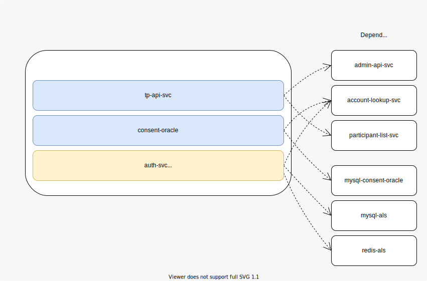

# thirdparty

Helm charts for Mojaloop Thirdparty API



## Overview

The Thirdparty API is an overlay services API that adds support for 3rd Party Payment Initiators to a Mojaloop Switch.

### Sub-Charts
- [chart-auth-svc](./chart-auth-svc) - Central Auth-Svc
- [chart-consent-oracle](./chart-consent-oracle) - CONSENT IdType oracle for the ALS
- [chart-tp-api-svc](./chart-tp-api-svc) - Thirdparty Api Service

## Components

### Third Party API Service

The core of the 3P-API is handled by the Third Party API Service (tp-api-svc), which implements the Third Party API as defined in the [Mojaloop 3P API Specification](https://github.com/mojaloop/mojaloop-specification/tree/master/thirdparty-api).

The Third Party API Service routes messages between PISPs, DFSPs and the Auth Service.

### Auth Service

The Auth Service (auth-svc) is an optional component that validates and stores Consent objects; representations of the relationship between an end User, a DFSP and a PISP. A Consent object contains a credential, which is used to validate an authorization for a Third Party Transaction Request.

When deploying the Third Party API Charts, the Auth-Service is _enabled_ by default.

### Consent Oracle

When a Consent is created by a DFSP, we use the Account Lookup Service to store the `fspId` of the _owner_ of the Consent object, either the id of the Auth-Service who registered it, or if an Auth Service is not being used by a DFSP, then the id of the DFSP who issued the Consent.

The Consent oracle stores the relationship between a `consentId` and an `fspId`.

## Deploying the 3P-API

Ensure that Backend Dependencies are deployed. Refer to the [example-mojaloop-backend](../example-mojaloop-backend/README.md) Helm chart for instructions details.

Or manually deploy them using the following:

```bash
# install the example dependencies for the thirdparty charts
# skip these steps if you want to deploy them yourself
cd chart-auth-svc
kubectl apply -f ./example_dependencies.yaml
cd ../chart-consent-oracle
kubectl apply -f ./example_dependencies.yaml
```

*Note:* you will need to customize the [./values.yaml](./values.yaml) with the appropriate configs for MySQL, and Redis dependencies if the `example_dependencies.yaml` is used. Refer to the service names in each of the deployment descriptors:

- [./chart-auth-svc/example_dependencies.yaml](./chart-auth-svc/example_dependencies.yaml)
- [./chart-consent-oracle/example_dependencies.yaml](./chart-consent-oracle/example_dependencies.yaml)

In addition to enabling the above charts, a few options must be configured to allow 3P-API support when you deploy Mojaloop.

For the `mojaloop/mojaloop` helm chart, enable the following in your `values.yaml`:

```yaml
...
account-lookup-service:
  account-lookup-service:
    config:
      featureEnableExtendedPartyIdType: true # allows the ALS to support newer THIRD_PARTY_LINK PartyIdType

  account-lookup-service-admin:
    config:
      featureEnableExtendedPartyIdType: true # allows the ALS to support newer THIRD_PARTY_LINK PartyIdType
...
```

And run the following from the `/thirdparty` directory

```bash
# install as a standalone chart, alongside Mojaloop
helm upgrade --install thirdparty mojaloop/thirdparty --values ./values.yaml
```

You could also install the Thirdparty charts _with_ a mojaloop deployment by configuring the following in your master `values.yaml`:

```yaml
...
thirdparty:
  enabled: true
  ...

```

Or alternatively add `--set` for each of the above parameters on the install command:

```bash
helm install ... \
  # enabled Thirdparty support on Account-lookup-services
  --set account-lookup-service.account-lookup-service.config.featureEnableExtendedPartyIdType=true \
  --set account-lookup-service.account-lookup-service-admin.config.featureEnableExtendedPartyIdType=true \
  # enabled Thirdparty components
  --set thirdparty.enabled=true
```

## Validating and testing the 3P-API

After setting the required configuration flags to enable Thirdparty features and components, specific tests can be enabled to verify your installation...

1. Ensure Tests are enabled

Ensure the following properties are set in your values file:

- ml-ttk-test-setup-tk.tests.enabled=true
- ml-ttk-test-val-tk.tests.enabled=true

Or alternatively add `--set` for each of the above parameters on the install command:

```bash
helm install ... \
  # enabled Thirdparty setup
  --set ml-ttk-test-setup-tp.tests.enabled=true \
  # enabled Thirdparty validation tests
  --set ml-ttk-test-val-tp.tests.enabled=true
```

2. Run Tests

Run tests:

`helm test <RELEASE_NAME>`

Run tests with logs:

`helm test <RELEASE_NAME> --logs`

3. Known issues

- Thirdparty TTK Test-Collection is not repeatable - [#2717](https://github.com/mojaloop/project/issues/2717)
