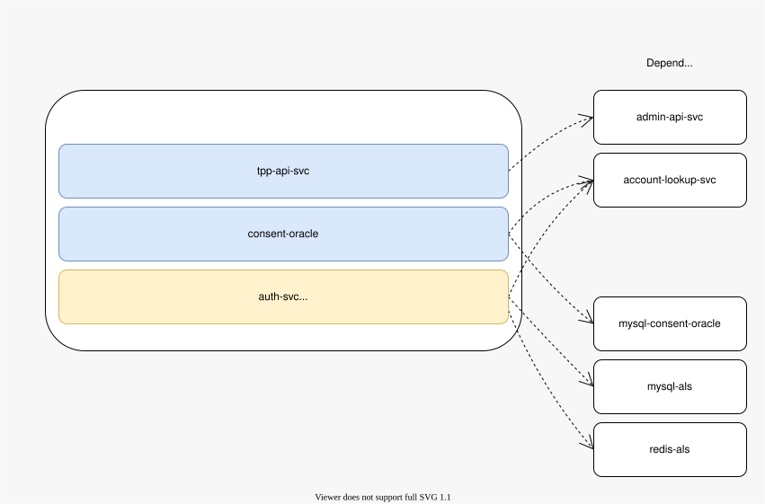

# thirdparty-v2

This folder has the Helm charts to run `tpp-api-svc`, which is based on the Mojaloop PISP v2.0 API.

## What is this?

Mojaloop lets people pay each other. Some payments are started by a third app, not by the bank app itself. This is called "Third Party Payments" (or PISP for short).

This new service `tpp-api-svc` which is based on Mojaloop PISP v2.0 replaces the older versions based a v1.0 of the PISP API

This folder (`thirdparty_v2.0`) is where we are adding Helm charts for the **new** `tpp-api-svc`, so people can install it and try it out, before it becomes the official version everyone uses.

## What does `helm install` actually do here?

When you run `helm install` on this chart, it deploys exactly **3 things**:

1. `tpp-api-svc` — the Third Party API Service based on PISP v2.0 API
2. `consent-oracle` — keeps track of who owns which consent
3. `auth-svc` — checks and stores consent, so the third-party app is allowed to act

> **Important:** this chart does **not** install `als` (account-lookup-service), `admin-api-svc`, or any MySQL/Redis databases. Those must already be running in your cluster before you install this chart. `als` and `admin-api-svc` are part of the main Mojaloop switch (installed separately, via the `mojaloop/mojaloop` chart). MySQL and Redis are things you need to set up yourself — see the `example_dependencies.yaml` files inside `chart-auth-svc` and `chart-consent-oracle` for a quick way to try this out locally.

## Why does `tpp-api-svc` depend on `consent-oracle` and `auth-svc`?

We are **assuming** this, based on how the old `thirdparty/` folder is set up in this same repo — the old service also needed `auth-svc` and `consent-oracle` to work. Nobody from the Mojaloop team has confirmed this in writing yet for the new service. If it turns out `tpp-api-svc` needs something different, this list will need to change.

## Sub-Charts

All three sub-charts below were copied from the `thirdparty` directory (the old v1.0 setup) as a starting point.

- [chart-tpp-api-svc](./chart-tpp-api-svc) — the new Third Party API Service (`tpp-api-svc`). Copied from `chart-tp-api-svc`, then changed to match the new service — new image, new port, new config.
- [chart-auth-svc](./chart-auth-svc) — Central Auth Service. Copied as-is, not changed yet.
- [chart-consent-oracle](./chart-consent-oracle) — keeps track of consent ownership. Copied as-is, not changed yet.

## Diagram

Ref: [mojaloop/project#4517](https://github.com/mojaloop/project/issues/4517)
